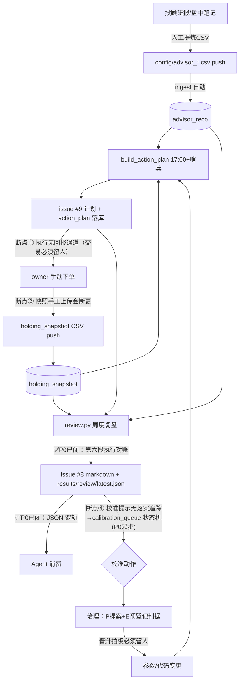

# 复盘闭环设计（2026-07-27 产品评审·owner 命题）

命题：复盘已覆盖投顾/收益/模型，缺「实际操作执行是否到位」的对账；且复盘要能被
Claude Code / Codex 类 Agent 直接消费，整体链路闭环。本文是产品评审结论 + 落地路线，
P0 已随本批实现（复盘第六段 + JSON 双轨），P1/P2 待 owner 逐项批准。

## 一、闭环链路与断点

**留人红线**（不因自动化软化）：交易执行、主动偏离改判（ack）、治理晋升签核、投顾笔记原始录入。
**Agent 可全权**：对账计算、JSON 产出、校准队列维护、提案草稿、验证跑批、执行率趋势监控。

## 二、执行对账（P0 已实现，核心 `invest_model/review/execution.py`）

算法：action_plan（终版指令）× holding_snapshot（每日实际股数）快照差分。
基线=计划日≤最近快照；观察窗 5 交易日；1 手容忍；买类挂单价窗内 low/high 从未触及=
「条件未触发」豁免（买点没到不买恰是纪律好）；送转窗（复权因子变动）跳过；
快照缺口=「无法对账」一等状态绝不硬算。「该止损未止」告警需四条同时成立：
强风控条款（硬止损/破MA/账户回撤/排雷）+ 未执行≥2交易日 + 触发条件事后仍成立 + 未 ack。
呈现基调：只陈述计划说了什么/实际发生了什么/差多少钱；未执行事后有利的同样如实列出，
用累计净成本防单笔幸存偏差；禁止"违纪"措辞。

已知盲区（JSON data_quality.known_biases 同步声明）：做T 快照差分不可见；
同决策日修订覆盖后对账用终版；无成交流水、执行价以次日收盘近似。

## 三、Agent 消费（P0 已实现）

markdown（人读，issue #8）与 JSON（Agent 读，`results/review/latest.json`）同批同源产出；
事实/结论物理分离、口径注册表版本化、data_quality 三件套。详见 `docs/review_schema.md`。

## 四、落地路线（P0 已上，P1/P2 逐项等 owner 批）

| 档 | 项 | 改动面 | 状态 |
|---|---|---|---|
| P0 | 第六段执行对账 | review.py + invest_model/review/execution.py（只读） | ✅ 2026-07-27 |
| P0 | JSON 双轨 + schema 文档 | review.py `--json-dir` + review.yml commit 产物 | ✅ 2026-07-27 |
| P0 | 快照覆盖率进 data_quality + 断更可见化 | 并入上两项 | ✅ |
| P1 | execution_ack 主动偏离通道 | 新表 + `config/execution_ack_*.csv` push 入库（照抄 ingest-snapshot 模式）——owner 一行确认"我知道、我改判"即静默 | 待批 |
| P1 | 计划 hints 用对账结果替换「待办·还没卖」 | action_plan.py 提示层（`EXEC_RECON_HINTS=0` 回退开关） | 待批（改生产计划链路，中风险） |
| P1 | 对账落库 + review_report 增 report_json 列（前端卡片） | schema.py 迁移 + fe-journey-faas/invest-journey 联动 | 待批 |
| P2 | calibration_queue 满足条件时 Agent 自动起草提案 PR（只产草稿、晋升仍走治理，同结论频控一次） | 新 workflow | 待 P0/P1 数据跑稳 4-6 周 |
| P2 | 前端执行确认打勾 / 券商截图 OCR 半自动快照 | 三仓联动 | 排最后 |

## 五、现有五段的遗留缺口（评审记录，未在 P0 处理）

- 一段统计"全部推荐"而非"owner 实际采纳子集"——采纳错位不可见（依赖执行对账数据积累后可做）；
- 二段缺"参谋异议行事后验证"（模型标后20%的持仓真跌了吗、owner 听没听、各自后验收益）——参谋价值的唯一实盘证据；
- 三段区间归因把行情波动与加减仓现金流混算；清出票实现盈亏放弃对账（无成交流水根因，快照diff×ref_price 可近似）；
- 各段「📌校准提示」发完即散——P0 的 calibration_queue 是起步，P2 的提案草稿自动化是终态。
